# TeslaMate 全中文版 Grafana 仪表盘

**目录**

- [你是谁？怎么走？](#who-are-you)
- [⚡ 升级到最新版](#upgrade-latest)
- [📸 效果预览](#screenshots)
- [🎯 特点](#features)
- [📊 汉化成果](#localization-stats)
- [📚 使用文档](#docs)
- [📁 包含的仪表盘](#dashboards-included)
- [🚀 快速开始](#quick-start)
- [🔧 故障排除](#troubleshooting-entry)
- [📦 镜像信息](#image-info)
- [🇨🇳 中国大陆用户专项配置](#cn-region)
- [🔒 SQL 远程拉取的信任模型](#sql-trust-summary)
- [🛠️ 系统要求](#requirements)
- [📚 相关链接](#related-links)
- [👏 贡献者](#contributors)
- [🤝 贡献指南](#contributing)
- [📄 License](#license)
- [🙏 致谢](#acknowledgements)
- [💬 问题反馈](#feedback)
- [💰 支持项目](#support)

> 给中国 Tesla 车主用的 TeslaMate 数据可视化方案 — 45 个深度汉化仪表盘 + 国内地图源 + 分时电价 + Docker 一键部署。

**和官方原版的差异**：

- 🌏 **国内可用** — 9 个地图面板支持高德/谷歌切换，自动 GCJ-02 坐标纠偏（轨迹精准贴道路）
- ⚡ **分时电价系统** — 为收藏点（Geofence，数据库中称地理围栏）配置峰平谷电价 + 充电桩性价比榜 + 重算历史充电（v1.5.0+）
- 📊 **13 个原创分析仪表盘** — 年度驾驶报告 / 省钱分析 / 充电健康管理 / ⚡ 行车 vs 停车耗电（月度）/ 出行规律分析 / 动能回收分析 / 驾驶评分 / 胎压 / 多车对比等
- 🆕 **2 个上游精选移植**（v1.7.0）— 回本分析（电车比油车几年回本）/ 速度温度热力图
- 🇨🇳 **本地化优化** — Docker Hub 镜像直拉无墙、PostgreSQL 与 Grafana 版本跟齐官方
- ✅ **开箱即用** — `bash simple-deploy.sh` 5 分钟装好，自动检测云主机并加固安全

> **English speakers**: this is a localization for Chinese-speaking Tesla owners. For the original project see [teslamate-org/teslamate](https://github.com/teslamate-org/teslamate).

---

<a id="who-are-you"></a>

## 你是谁？怎么走？

| 🚀 新用户 | 🇨🇳 国内用户 | ⬆️ 老用户升级 |
|---|---|---|
| 第一次装 TeslaMate？从 [**安装场景选择器**](#quick-start) 进入对应的 QUICKSTART 权威步骤。 | **第一次装前必看** → [**中国大陆专项配置**](#cn-region)（镜像源 / NOMINATIM_PROXY / 安全组）。<br><br>装完踩坑 → [故障排查手册](TROUBLESHOOTING.md)。 | 已经在用，想升新版？查 [**升级到最新版**](#upgrade-latest)，按原安装方式选一条最小命令。 |

---

<a id="upgrade-latest"></a>
<a id="upgrade-v16"></a>

## ⚡ 升级到最新版

升级前先按 [数据库备份与恢复](TROUBLESHOOTING.md#数据库备份与恢复) 做一份完整备份。然后只按原安装方式执行一条路径；不要把 A、B、C 混着跑。

<a id="upgrade-method-a"></a>

### 方法 A — 一键脚本用户

```bash
curl -fsSL https://raw.githubusercontent.com/wjsall/teslamate-chinese-dashboards/main/simple-deploy.sh | bash
```

脚本会识别现有安装并进入升级模式：拉取镜像、更新四组 SQL 对象、检查 `volkovlabs-form-panel` 插件并重启 Grafana；不会重置 `ENCRYPTION_KEY` 或其他配置。安装或升级时的自动备份选项（含密钥 / 不含密钥 / 不启用，含群晖 DSM 设置）见 [定期自动备份数据库](TROUBLESHOOTING.md#db-backup)。

<a id="upgrade-method-b"></a>

### 方法 B — git clone 用户

```bash
cd teslamate-chinese-dashboards
bash scripts/upgrade.sh
```

脚本依次执行 `git pull`、PostgreSQL 检测、四组 SQL 对象更新、Grafana 插件检查和 Grafana 重启；可重复执行，不会清空数据。

<a id="upgrade-method-c"></a>

### 方法 C — 自写 Compose / Watchtower 用户

```bash
docker compose pull && docker compose up -d
```

这条命令只更新镜像。新版本涉及 SQL 时，再执行唯一的 [四个 SQL 安装文件修复循环](TROUBLESHOOTING.md#repair-sql-install)；它会自动探测 database 容器，任一文件失败即停止，完成后重启 Grafana。Watchtower 也只换镜像，因此同样要补这一步。纯仪表盘版本（例如 v1.7.10）只需更新镜像。远程 SQL 的版本锁定与信任边界见 [SQL 远程拉取的信任模型](TROUBLESHOOTING.md#sql-trust-model)。

<a id="upgrade-method-d"></a>

### 方法 D — 从官方 TeslaMate 迁移

```bash
curl -fsSLO https://raw.githubusercontent.com/wjsall/teslamate-chinese-dashboards/main/migrate-from-official.sh
bash migrate-from-official.sh
```

[`migrate-from-official.sh`](migrate-from-official.sh) 是唯一正常迁移入口。它会预检 Docker daemon 与 Compose CLI（v1/v2），查找 `docker-compose.yml` / `compose.yml`，以 mode 600 备份含 `ENCRYPTION_KEY` 的配置，再更换 Grafana 镜像、探测 database 容器并安装四组 SQL 对象；TeslaMate、PostgreSQL、MQTT 和车辆数据不动。脚本末尾会给出 `cp + $DC up -d` 回滚命令。

如果曾手动修改仪表盘，迁移前先在 Grafana 中进入「仪表盘 → ⋮ → Export」导出 JSON；迁移会加载本项目版本。脚本无法运行时才使用 [手动迁移兜底](TROUBLESHOOTING.md#manual-migration-fallback)。

分时电价是可选功能，升级完成后按 [QUICKSTART 的分时电价配置](QUICKSTART.md#tou-config) 操作。它包含城市模板、交互式向导、历史回算和回滚入口；未配置时，费用面板继续使用原 `cp.cost`。升级故障和完全回滚见 [分时电价升级排错 / 回滚](TROUBLESHOOTING.md#tou-rollback)。v1.6.6 修复过旧版恢复流程缺 `DROP SCHEMA private` 与 `CREATE EXTENSION cube` 导致 Token 解密失败的问题，背景和当前正确流程见 [数据库备份与恢复](TROUBLESHOOTING.md#数据库备份与恢复)。

---

> 🚗 基于 [TeslaMate](https://github.com/teslamate-org/teslamate) 项目的 Grafana 仪表盘汉化版本
>
> 📖 原版文档: https://docs.teslamate.org
>
> 🙏 早期汉化工作参考自 GitHub 用户 [@dhuar](https://github.com/dhuar) 的私有镜像 `ccr.ccs.tencentyun.com/dhuar/grafana:latest`，在此致谢


[](https://t.me/+BeOASgmvE_IyNzNl)

<a id="screenshots"></a>

## 📸 效果预览

### 🌡️ v1.6.0 新增：天气-能耗关联

国内特斯拉车主 #1 痛点「冬天到底掉多少电」量化版 — 温度桶能耗曲线柱色冷蓝→热红，一眼看出「16°C 最省 / 38°C 最费」的 U 型规律 + 月度双轴 + 季节对比。

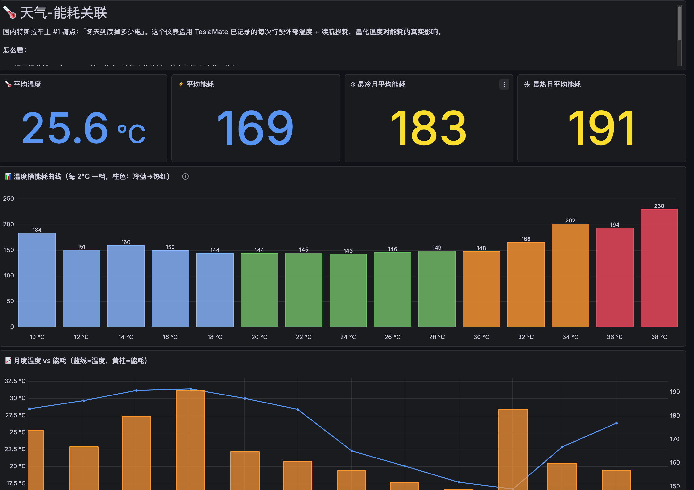

### ⚡ v1.5.0 重磅功能：分时电价系统 + 充电桩性价比榜

**「⚡ 分时电价配置」** — 24 小时电价柱图自动配色（绿=谷 / 黄=平 / 橙=峰）+ 配置审计 + 写操作提交前二次确认；「全局默认」用于没有收藏点或缺少位置的充电记录
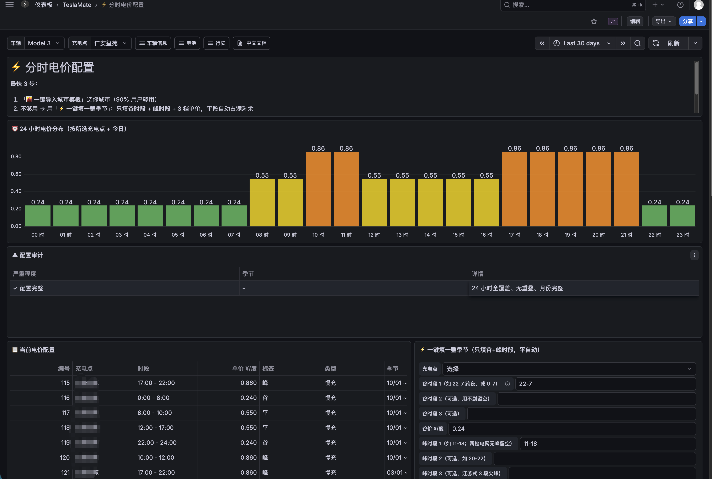

**「🏆 充电桩性价比榜」** — 按 ¥/度 排序充电点（家充走分时电价、第三方走原价）+ 30 天涨/降价对比 + 充电桩地图；按收藏点聚合，同名地点不会再被错误合并
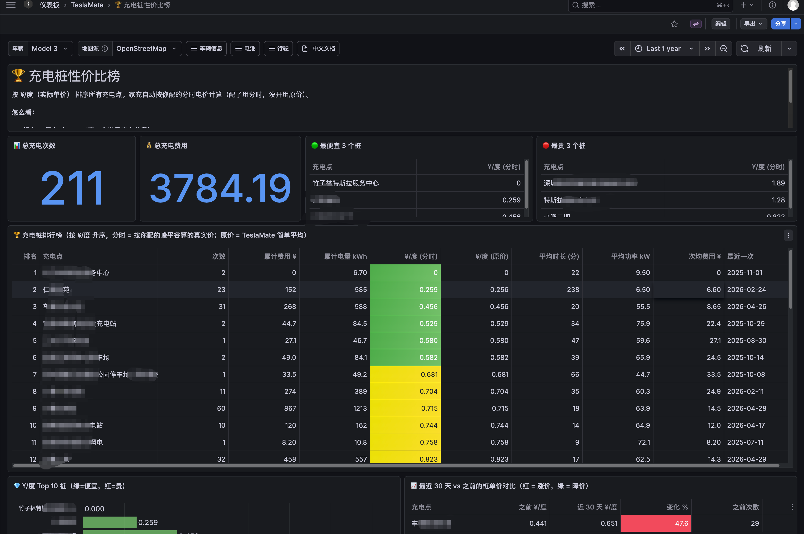

### 🌏 v1.4.2 重磅功能：地图源一键切换 + 自动 GCJ-02 坐标纠偏

仪表盘顶部下拉框秒切 6 种瓦片源（OSM / 高德 / 高德卫星 / 谷歌 / 谷歌卫星 / Carto）。选高德或谷歌路网时 PostgreSQL 函数自动做 WGS-84 → GCJ-02 转换，车辆轨迹精准贴合道路。

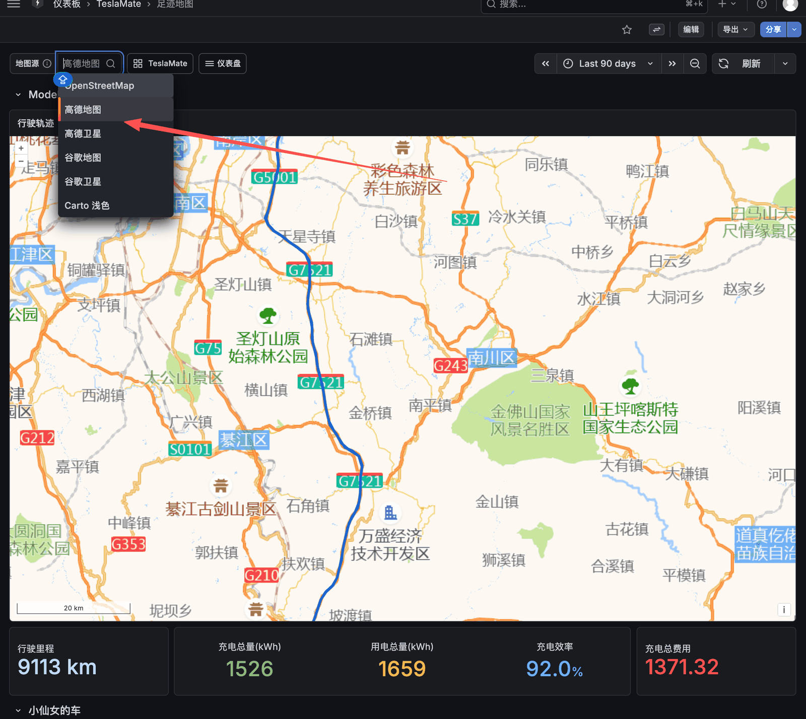

### 🆕 原创分析仪表盘

**年度驾驶报告** — 年份动态生成并跟随所选年份，汇总里程 / 充电 / 能耗 / 常去地点 TOP10，排除未完成记录


**省钱分析** — 用「行驶能耗 × 同期平均电价」的能量匹配口径估算用电成本并与燃油车对比；缺少电价数据时显示 `No data`


**充电健康管理** — 充电习惯评分、SOC 分布、充电次数趋势；仅统计已完成且充电量 ≥1 kWh 的有效充电


**「⚡ 行车 vs 停车耗电（月度）」** — 统计每月行车电耗与停车耗电，并拆分醒着 / 休眠停车；停车口径不能等同于哨兵模式耗电


**出行规律分析** — 时段分布、工作日 vs 周末、温度与能耗关系


**动能回收分析** — 各固件版本回收率对比、每日/每周回收能量、温度影响
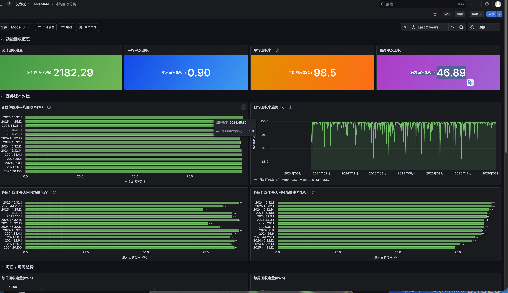

**多车对比** — 名下所有车辆里程/能耗/费用/电池健康横向对比，自动适配车辆数量


**续航退化分析** — 满电续航趋势、线性回归退化率、月度统计、数据质量监控


**驾驶评分** — 效率/平稳/速度/回收四维度评分、驾驶风格判定、行程明细与数据汇总


---

### 核心仪表盘

| 概览 | 电池健康度 |
|------|-----------|
| 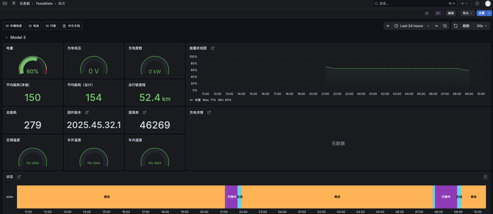 | 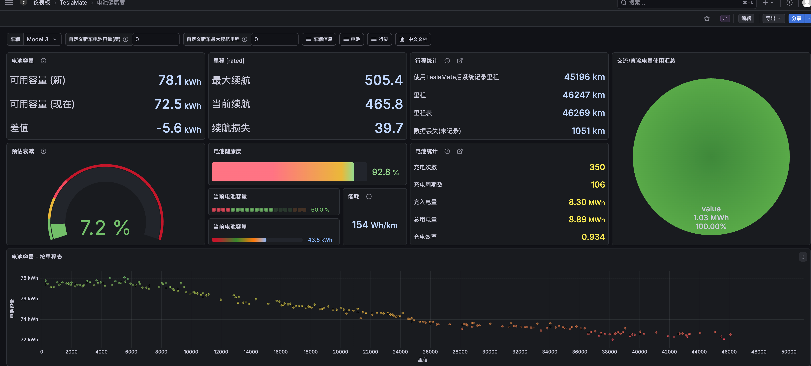 |

| 车辆里程统计 | 充电记录 |
|---------|---------|
| 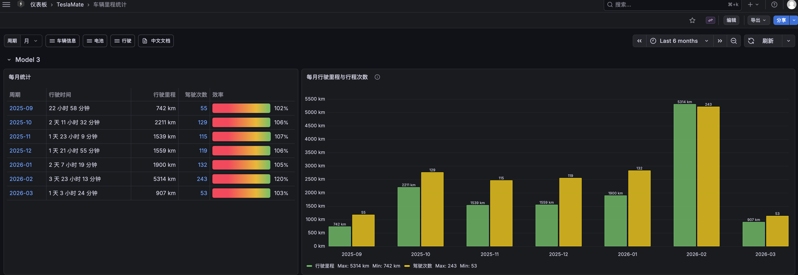 | 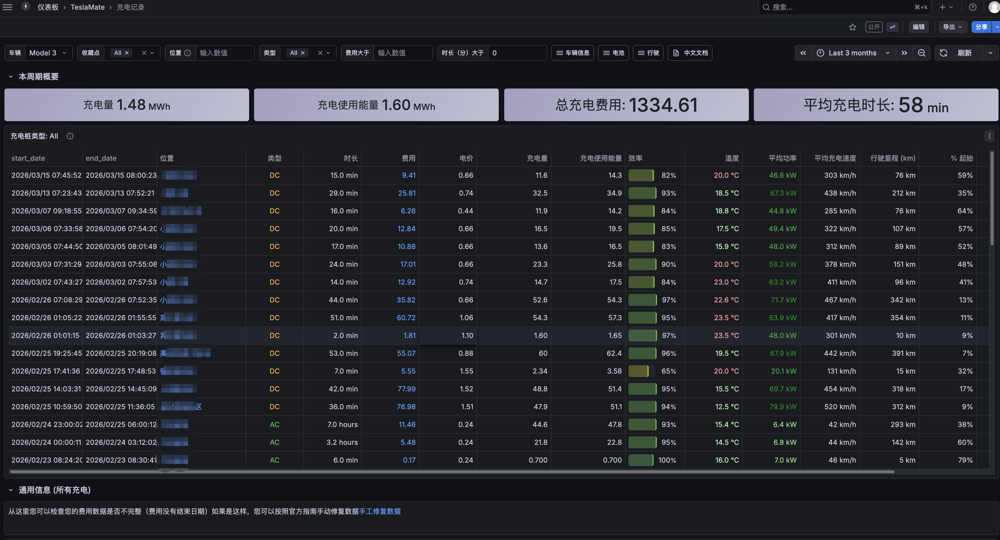 |

| 电池容量曲线图 | 驾驶记录追踪 |
|------------|------------|
| 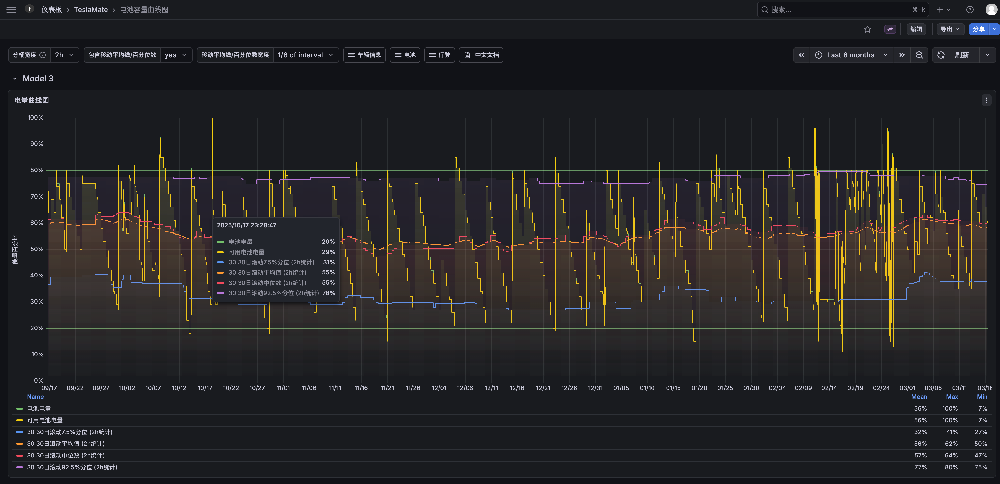 |  |

| 时间线 | 电池容量曲线图（第二张预览） |
|--------|-----------------|
| 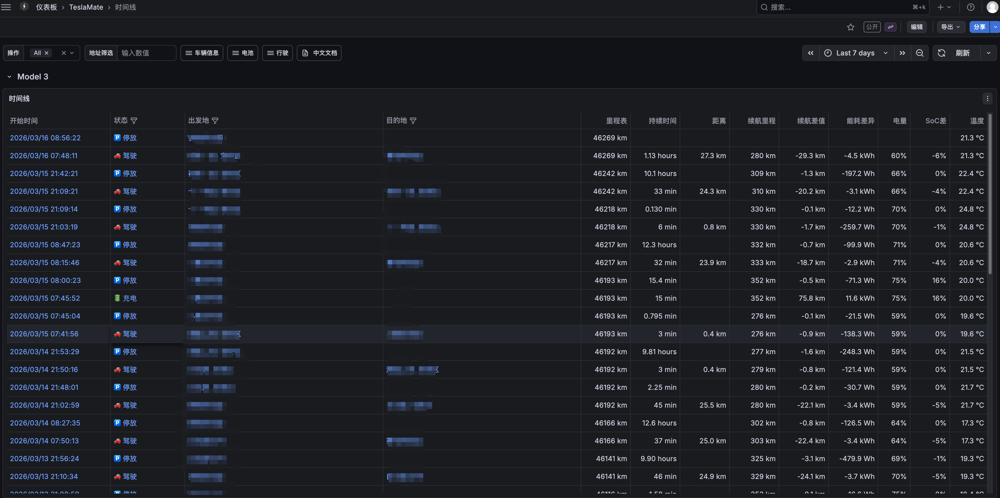 | 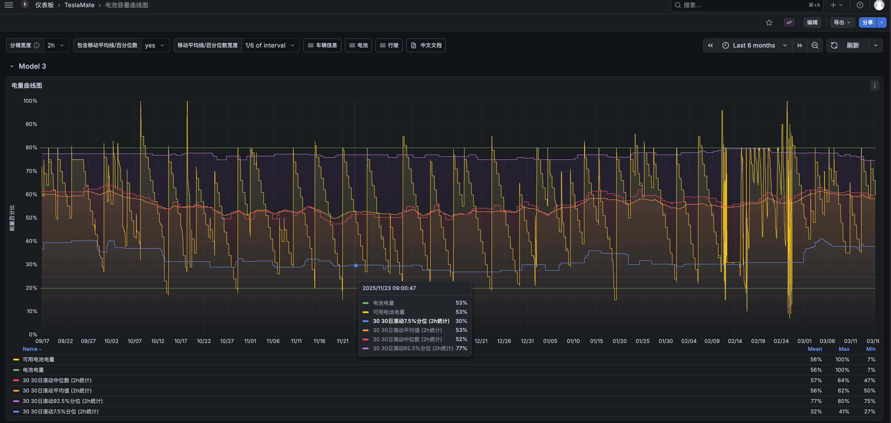 |

---

<a id="features"></a>

## 🎯 特点

- ✅ **开箱即用** - 无需 Docker Hub 账号，直接挂载使用
- ✅ **一键安装** - 提供多种安装方式，5分钟完成部署
- ✅ **持续更新** - 通过 git pull 即可获取最新汉化
- ✅ **深度汉化** - 45 个仪表盘，含 13 个全新原创分析图表
- 🌏 **地图源一键切换（独有）** - 9 个含地图仪表盘顶部加 OSM / 高德 / 高德卫星 / 谷歌 / 谷歌卫星 / Carto 下拉框，秒切，自动 GCJ-02 坐标纠偏（v1.4.2+）
  - 国内用户告别手动改 SQL，海外华人用户也能用谷歌中文路网
- ✅ **完整适配 TeslaMate 4.0** - 同步官方全部新特性，已在 **TeslaMate v4.0.1 + Grafana 13.0.1** 实测兼容

<a id="localization-stats"></a>

## 📊 汉化成果

| 指标 | 数值 |
| --- | --- |
| 仪表盘数量 | 45 个 ✅ |
| 内部详情页 | 3个（行程/充电详情）|
| 文件总大小 | ~1.2MB |
| 汉化完成度 | 99%+ |
| 质量等级 | A+ |
| 最后更新 | 2026-07 |

**45 个仪表盘深度汉化，持续优化中，开箱即用！** 🎉

<a id="docs"></a>

## 📚 使用文档

我们为你准备了五份详细的使用指南：

| 文档 | 说明 | 适合人群 |
|------|------|----------|
| **[新手向导](QUICKSTART.md)** | 从零开始安装，含 FAQ | 完全新手 |
| **[功能地图](DASHBOARD_MAP.md)** | 45 个仪表盘分类导航 | 新用户 |
| **[场景速查手册](SCENE_GUIDE.md)** | 什么时候看什么仪表盘 | 所有用户 |
| **[数据指标手册](METRICS_GUIDE.md)** | 指标解释、正常范围、异常处理 | 进阶用户 |
| **[故障排查手册](TROUBLESHOOTING.md)** | 遇到问题按症状查解决方案 | 遇到问题时 |

**新手建议**：先看「新手向导」→「功能地图」→「场景速查手册」→「数据指标手册」

<a id="dashboards-included"></a>

## 📁 包含的仪表盘

**45 个仪表盘** 按主题分布在电池 / 充电 / 驾驶 / 位置 / 车辆状态 / 原创分析 / 系统信息 等分类下。完整功能列表 + 字段映射 → [DASHBOARD_MAP.md](DASHBOARD_MAP.md)

<a id="quick-start"></a>

## 🚀 快速开始

安装流程只在 QUICKSTART 维护，README 不再复制命令。按你的实际场景进入对应锚点：

| 你的情况 | 唯一入口 | 入口里保留的信息 |
|---|---|---|
| **从零开始，想最快装好** | [QUICKSTART：一键脚本](QUICKSTART.md#one-click-install) | 机器准备、Docker、安装、密钥备份、登录和验收清单 |
| **从零开始，自己写 Compose** | [QUICKSTART：手动 Docker Compose](QUICKSTART.md#manual-compose) | 完整 Compose、密码与 `ENCRYPTION_KEY`、启动和 SQL 安装入口 |
| **已有官方英文 TeslaMate，换中文版** | [迁移方法 D](#upgrade-method-d) / [`migrate-from-official.sh`](migrate-from-official.sh) | 预检、配置备份、换镜像、SQL 安装与回滚 |
| **已有自定义 Grafana，只挂载本项目 JSON** | [QUICKSTART：手动挂载仪表盘](QUICKSTART.md#manual-dashboard-mount) | Grafana 版本要求、两条挂载路径、中文环境变量与 SQL 安装入口 |
| **已经装过，只想升级** | [升级到最新版](#upgrade-latest) | 按原安装方式选择最小命令 |

中国大陆镜像拉取失败时，直接走 [故障排查中的镜像修复](TROUBLESHOOTING.md#image-pull-cn)；不要在多份安装文档间复制镜像源配置。

<a id="troubleshooting-entry"></a>

## 🔧 故障排除

完整故障排查手册 → [TROUBLESHOOTING.md](TROUBLESHOOTING.md)（覆盖部署 / 仪表盘显示 / 数据 / Tesla 授权 / 升级 / 中国大陆专项等常见问题）

<a id="image-info"></a>

## 📦 镜像信息

| 镜像地址 | 说明 |
|----------|------|
| `ghcr.io/wjsall/teslamate-chinese-dashboards:latest` | 最新稳定版（GitHub Container Registry） |
| `bswlhbhmt816/teslamate-chinese-dashboards:latest` | Docker Hub 镜像（中国大陆推荐） |
| `ghcr.io/wjsall/teslamate-chinese-dashboards:sha-xxxxx` | 特定版本 |

镜像构建状态：[](https://github.com/wjsall/teslamate-chinese-dashboards/actions/workflows/ghcr-build.yml)

<a id="cn-region"></a>

## 🇨🇳 中国大陆用户专项配置

**TeslaMate 3.0 起，国内账号通常什么都不用改**。登录方式是粘贴 Access Token / Refresh Token（推荐用 [tesla_auth 桌面版](https://github.com/adriankumpf/tesla_auth/releases) 拿，TeslaMate 主作者维护，跨平台），TeslaMate 会从 token 自动识别中国区，所有 API/streaming 请求自动走 `*.cloud.tesla.cn`。详见 [QUICKSTART.md 第四步](QUICKSTART.md#step-4)。

镜像拉取慢或失败时，直接按 [中国大陆镜像修复](TROUBLESHOOTING.md#image-pull-cn) 选择 Docker Hub、镜像代理、网络代理或离线导入；可复制配置只在该修复锚点维护。

**⚠️ 国内用户高频踩坑：行程列表地址列空**

TeslaMate 的反向地理编码用 OpenStreetMap Nominatim，国内访问常超时，导致大量 drive 的 `start_address_id` 为 NULL，行程列表地址列空。修法是加一行 `NOMINATIM_PROXY` env（**仅代理 Nominatim 流量，不影响 Tesla API**）：

```yaml
services:
  teslamate:
    environment:
      - TZ=Asia/Shanghai
      # 国内用户强烈推荐：让 Nominatim 反查走代理（HTTP only，仅一行，详见下方链接）
      # - NOMINATIM_PROXY=http://你的代理IP:7890
      # 走自建 Fleet API 网关 / 反向代理时才需要：
      # - TESLA_API_HOST=https://your-proxy.example.com
      # - TESLA_WSS_HOST=wss://your-proxy.example.com
```

`NOMINATIM_PROXY` 完整说明 + 排错命令 + 代理地址填写指引：[TROUBLESHOOTING.md「Nominatim 国内反查超时」](TROUBLESHOOTING.md#nominatim-proxy)。

完整环境变量参考：[TeslaMate 官方文档](https://docs.teslamate.org/docs/configuration/environment_variables)

<a id="sql-trust-summary"></a>

## 🔒 SQL 远程拉取的信任模型

升级路径会从 GitHub 拉取四个 SQL 安装文件并交给 `psql` 执行；默认 `main` 与 `:latest` 同步，也可锁定 tag。
传输安全、来源与维护者风险、版本锁定方式，以及第三方/自建镜像的信任边界见 [故障排查手册：SQL 远程拉取的信任模型](TROUBLESHOOTING.md#sql-trust-model)。

<a id="requirements"></a>

## 🛠️ 系统要求

- Docker 20.10+
- Docker Compose 2.0+
- **PostgreSQL 技术最低 16，官方推荐 18**（官方默认 `postgres:18-trixie`）
  - 13 个仪表盘用三参数 `date_trunc` 时区聚合，PG 16 起支持，**PG ≤15 必报错**
  - PG 16/17 可运行全部仪表盘；新装或安排大版本维护时建议用 PG 18。升级前先看 [TROUBLESHOOTING.md「PostgreSQL 大版本升级」](TROUBLESHOOTING.md#postgresql-upgrade)
- 内存: 2GB+
- 磁盘: 10GB+

支持系统：
- ✅ Linux (Ubuntu/CentOS/Debian等)
- ✅ macOS (Intel/Apple Silicon)
- ✅ Windows (WSL2)
- ✅ 树莓派 **ARM64（64 位系统）** —— TeslaMate **v4.0 起已停止 ARMv7（32 位）支持**，老树莓派（Pi 3/4 装的 32 位 OS）需刷成 64 位系统才能升到 v4.0+

<a id="related-links"></a>

## 📚 相关链接

### 原版项目
- **GitHub**: https://github.com/teslamate-org/teslamate
- **官方文档**: https://docs.teslamate.org
- **原版 Grafana 仪表盘**: https://github.com/teslamate-org/teslamate/tree/master/grafana/dashboards

### 帮助文档
- **安装指南**: https://docs.teslamate.org/docs/installation/docker
- **常见问题**: https://docs.teslamate.org/docs/faq
- **升级指南**: https://docs.teslamate.org/docs/upgrading
- **环境变量**: https://docs.teslamate.org/docs/configuration/environment_variables

### 本汉化项目
- **GitHub**: https://github.com/wjsall/teslamate-chinese-dashboards
- **问题反馈**: https://github.com/wjsall/teslamate-chinese-dashboards/issues
- **中文文档**: https://github.com/wjsall/teslamate-chinese-dashboards

<a id="contributors"></a>

## 👏 贡献者

感谢以下贡献者的辛勤付出:

### 主要贡献者
- [@wjsall](https://github.com/wjsall) - 项目发起人、主要汉化
- 社区贡献者 - 翻译校对、建议反馈

<a id="contributing"></a>

## 🤝 贡献指南

欢迎提交 Issue 和 PR 改进汉化质量！报告问题、翻译流程、术语表、翻译原则、禁止事项、本地测试、验证清单和 PR 格式均以 [CONTRIBUTING.md](CONTRIBUTING.md) 为准。

<a id="license"></a>

## 📄 License

MIT License - 与 TeslaMate 项目相同

<a id="acknowledgements"></a>

## 🙏 致谢

- **原始汉化**: wjsall
- **整理优化**: Claude AI
- **验证测试**: 自动化脚本
- **原始项目**: [TeslaMate](https://github.com/teslamate-org/teslamate)
- **英文仪表盘参考**: [@jheredianet](https://github.com/jheredianet) — [Teslamate-CustomGrafanaDashboards](https://github.com/jheredianet/Teslamate-CustomGrafanaDashboards)，部分面板实现逻辑参考自其原版设计

<a id="feedback"></a>

## 💬 问题反馈

- GitHub Issues: https://github.com/wjsall/teslamate-chinese-dashboards/issues

---

**如果本项目对你有帮助，请给个 ⭐ Star！**

---

<a id="support"></a>

## 💰 支持项目

业余时间 1 个人维护。最有用的支持是 ⭐ Star、[报 Bug / 提建议](https://github.com/wjsall/teslamate-chinese-dashboards/issues)、加 [Telegram 群](https://t.me/+BeOASgmvE_IyNzNl) 帮其他车主装好。

| 微信打赏 | 支付宝打赏 |
|---------|-----------|
|  |  |

谢谢你 ❤️
